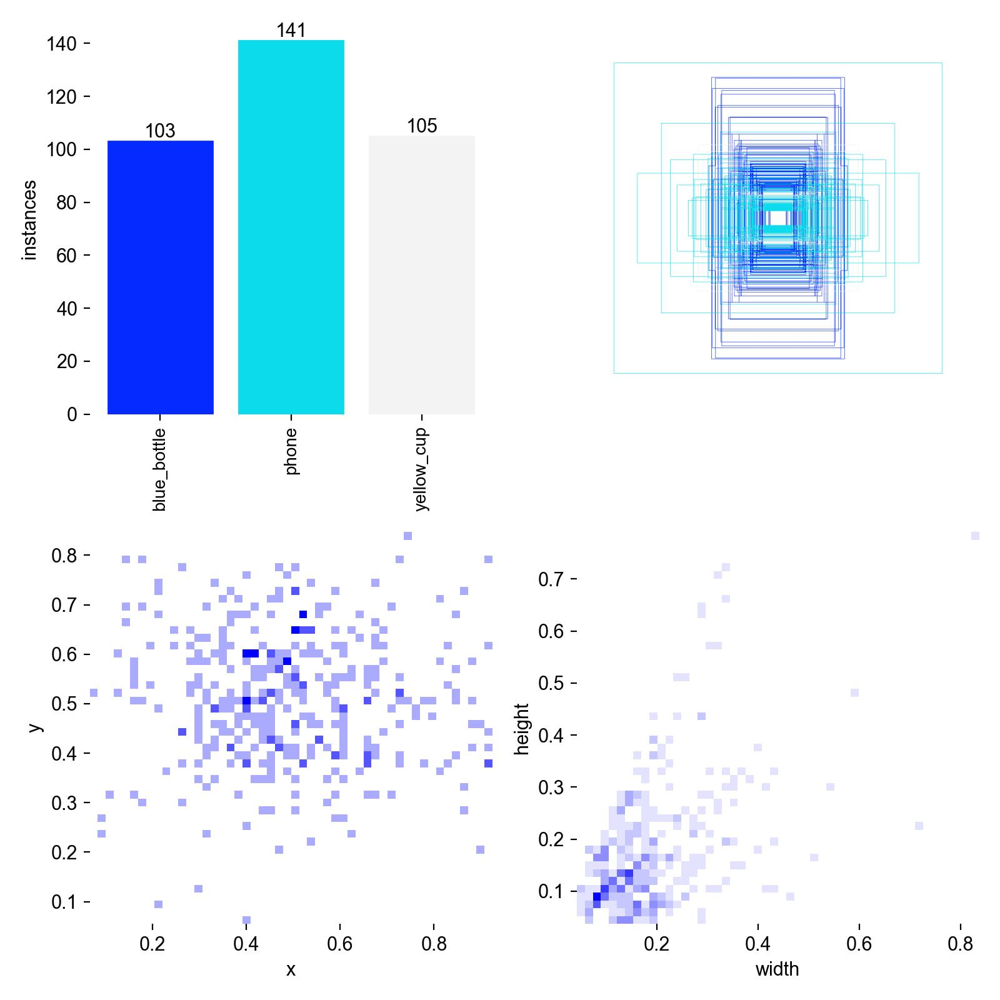
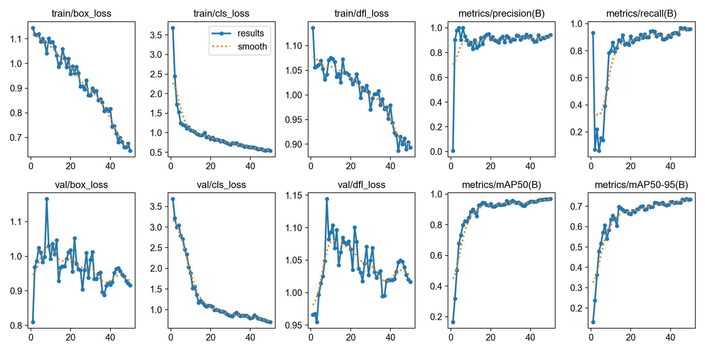
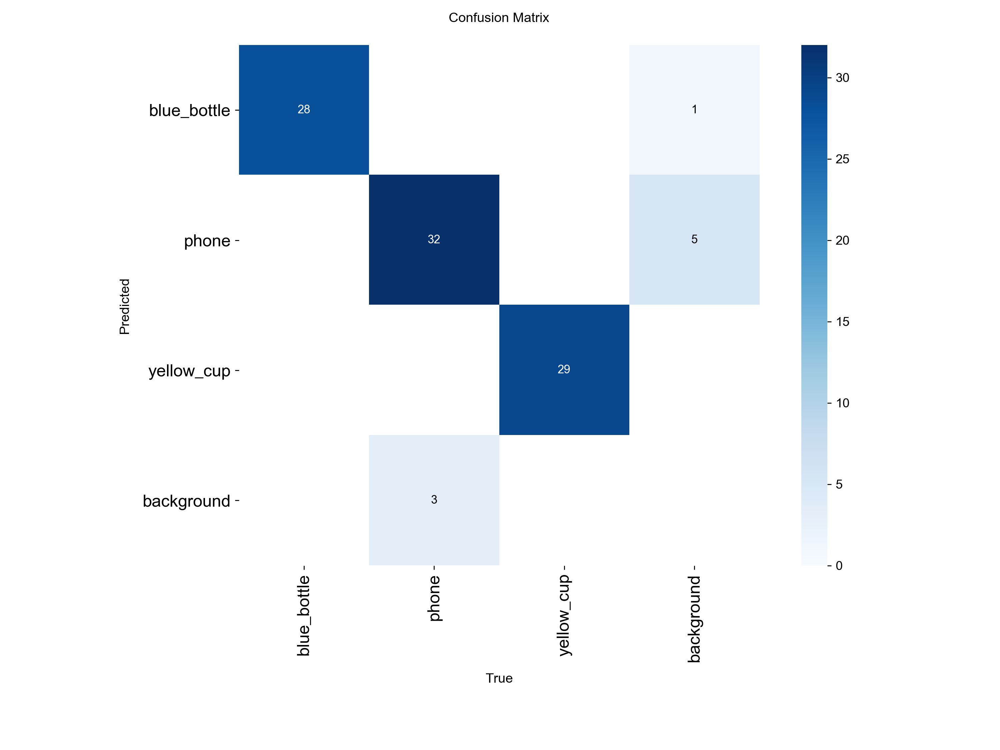

YOLO Object Detection Project
Objects: blue_bottle, yellow_cup, phone

1. Dataset Collection
For this project I created my own custom dataset. All images were captured using a smartphone camera in different everyday environments such as a kitchen,
outdoor tables, rocks, and indoor rooms. The goal was to detect three object classes:

- blue_bottle
- yellow_cup
- phone

To make the dataset more diverse, I photographed the objects from different angles, distances, and lighting conditions.
Some images also contain multiple objects at the same time. In total, the dataset contains 221 images.

2. Data Annotation
All images were annotated manually using Roboflow. For each object in the image I created a bounding box and assigned the correct class label.
After annotation, the dataset was automatically split into three subsets:

Training set: 70% (155 images)
Validation set: 20% (44 images)
Test set: 10% (22 images)

This structure allows the model to learn from the training data while its performance is evaluated on images it has not seen during training.

3. Model Training
The object detection model was trained using the official Ultralytics implementation of YOLOv8. I used pretrained weights so the network could build
on visual features it had already learned from large datasets.

Training configuration:

Model: YOLOv8n
Image size: 448
Epochs: 50
Dataset: custom dataset with 3 object classes

During training the model learned to:

- detect the location of objects using bounding boxes
- classify each detected object
- estimate the confidence of each detection

The label analysis shows that the dataset is relatively balanced between the three classes. The phone class appears slightly more frequently than
the others.
Most objects appear near the center of the images and have medium-sized bounding boxes. This is expected since the objects were intentionally
photographed.
The distribution of bounding box sizes and positions looks consistent, which helps the model learn object detection more effectively.

### Dataset Label Analysis

The following visualization shows the distribution of object classes and bounding box statistics in the dataset.

4. Training Results
After training, the model achieved the following results on unseen validation/test images:

Precision: 0.97
Recall: 0.96
mAP50: 0.98
mAP50-95: 0.75

These results indicate that the detector is able to correctly identify most objects with high precision and recall.

The confusion matrix also shows that most predictions fall on the diagonal, which means the objects are correctly classified.
The classes blue_bottle and yellow_cup are detected almost perfectly, while the phone class shows a few missed detections.

### Training Results

The following plots show how the model improved during training. The graphs include training and validation losses, as well as precision, recall, and mAP metrics.

### Confusion Matrix

5. Model Evaluation
The trained model was evaluated on images it had never seen before. The results show that:

- most objects are detected correctly
- bounding boxes are generally accurate
- some phones are occasionally missed, especially when the object blends with the background or is partially occluded

Overall, the model performs well given the relatively small dataset.

6. Real-Time Detection
Finally, I tested the trained detector on a live webcam feed. The model was able to detect the objects in real time and draw bounding boxes around them.

This demonstrates the main advantage of YOLO (You Only Look Once): object detection is performed in a single pass through the neural network,
which allows fast real-time predictions.

7. Conclusion
This project demonstrates the full workflow of building an object detection system:

- collecting a dataset
- annotating images
- training a deep learning model
- evaluating the results
- running real-time object detection

The trained model successfully detects the target objects and performs reliably in real-world scenarios.